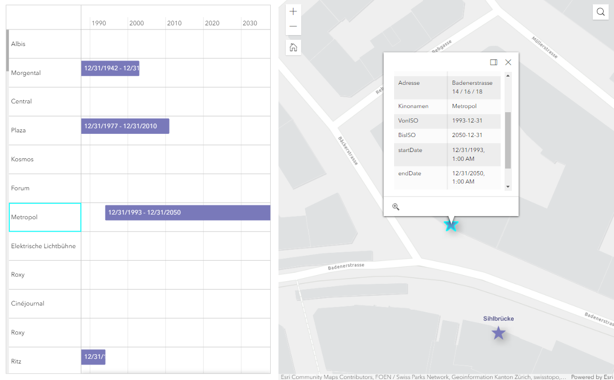
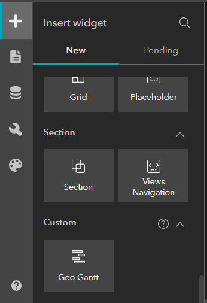
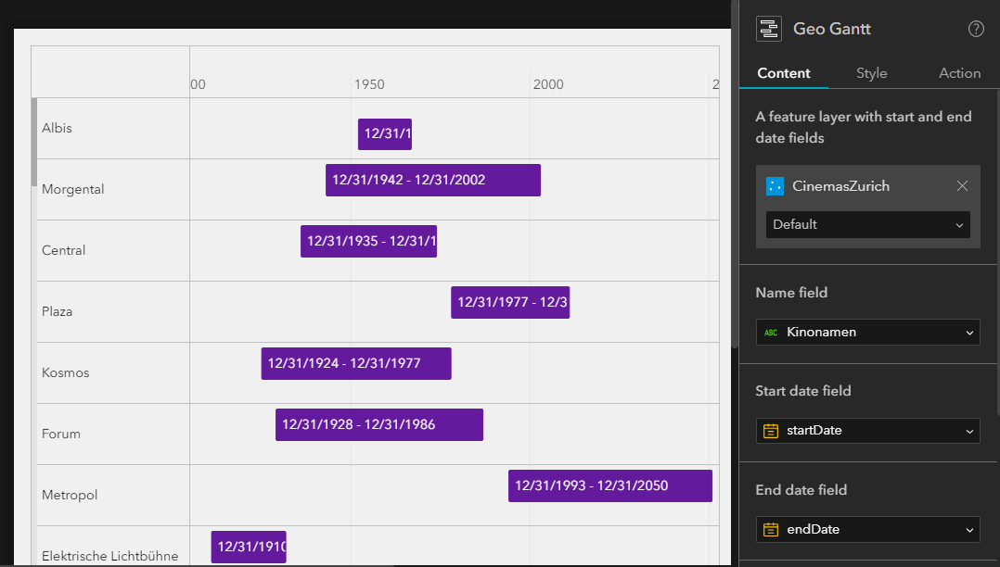
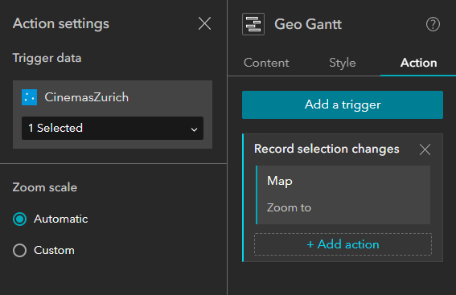

# Geo Gantt

An Experience Builder widget for displaying features with start and end dates in a list with a timeline.
In the example below we are using the widget to display the opening and closing dates of cinemas in Zurich, Switzerland:

## How to use it

Clone this [repository](https://github.com/RalucaNicola/geo-gantt) and copy this widget's folder to the `client/your-extensions/widgets` folder of your Experience Builder installation.

The widget will appear in the custom widgets:

Next, in the Settings panel you should add the data source, a feature layer with the data and the fields that contain the start and end dates:

The widget exposes the "Selected records changed" trigger, which can be used to trigger actions in other widgets when the user selects a record in the list. In the Actions panel, you can select how the other widget will behave when the user selects a record in the list. For example, here we are using the "Zoom to" action to zoom to the selected record in the map:

## Resources

- [ArcGIS Experience Builder Developer Guide](https://developers.arcgis.com/experience-builder/)
- [Widget Development](https://developers.arcgis.com/experience-builder/guide/getting-started-widget/)
- [Theme Development](https://developers.arcgis.com/experience-builder/guide/theme-development/)

## Issues

Find a bug or want to request a new feature? Please let us know by submitting an issue.

## Licensing

Copyright 2023 Esri

Licensed under the Apache License, Version 2.0 (the "License");
you may not use this file except in compliance with the License.
You may obtain a copy of the License at

http://www.apache.org/licenses/LICENSE-2.0

Unless required by applicable law or agreed to in writing, software
distributed under the License is distributed on an "AS IS" BASIS,
WITHOUT WARRANTIES OR CONDITIONS OF ANY KIND, either express or implied.
See the License for the specific language governing permissions and
limitations under the License.

A copy of the license is available in the repository's [License.txt](https://github.com/esri/arcgis-experience-builder-sdk-resources/blob/master/License.txt) file.
